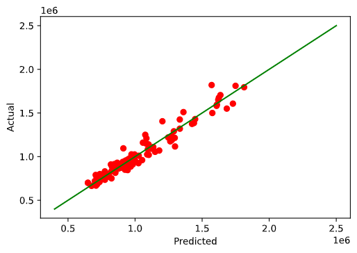
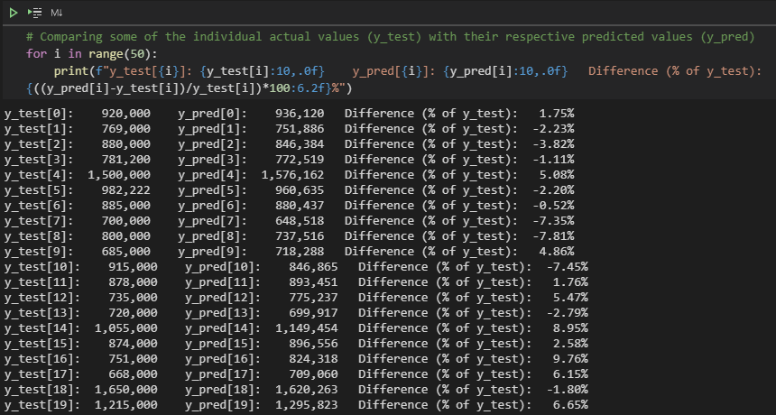
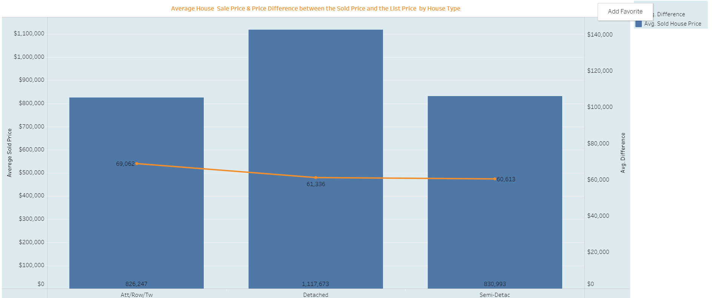
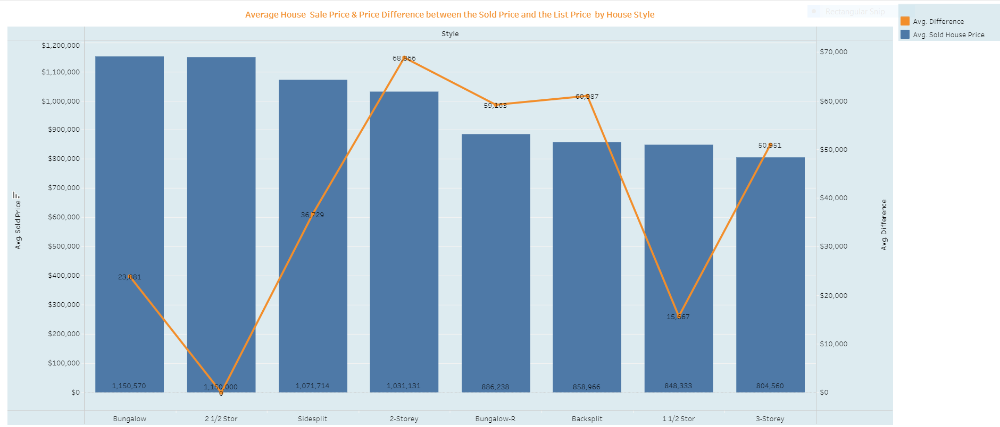

# Real Estate Analysis.

We are going to be using data from 2021 Ontario Real Estate sold house listings.  We want to answer questions whether the sold listings could predict future house prices based on the house's features (number of washrooms, bedrooms, etc), location.  

 
### Overview
Our chosen project examines house prices in the Greater Ontario Area in the year 2021.

 
## Data
The data are pdf files which show 26 rows.
The pdf files are converted into Excel files, cleaned up then saved as csv.  
Multiple Linear Regression model will be used to predict the future price of the house based on the house features listed above.
We are using SQLite for the Database.  

### Data Content 
1. "#" - The row number. 
2. LSC - The listing displays its contract status at the Last Status Change (LSC) field
3. EC - Describes whether the property has received the Encumbrance Certificate: certificate of assurance that the property is free from any legal or monetary liability
 
### Data Source
We were able to gather our data from a licensed realtor who has access to the most recent listing information about house sales in Brampton for last six months.  
### Questions that we hope to answer: 
1. Do unique features of the house (Washroom, bedroom, area, semidetached, attached) play an integral role with determining the sold price? 
2. Does the location, type, style, listing date and listing price play a factor of the sold price? 
3. When was it listed and how fast was it sold?  
 
## Machine Learning Model

We have created machine learning model to predict "Sold Price" of a house based on style, type, bedrooms, washrooms, and list price of a house. This can help a prospective buyer to decide how much to bid for the house. We have used Multiple Linear Regression model for this purpose. 

### Preliminary Feature Selection for Machine Learning Model

1. The preliminary feature selection was done using exhaustive feature selection method which is one of the **Wrapper Methods**. We trained machine learning model multiple times using different feature sets and comparing the results.
2. Since we are trying to predict the "Sold Price" of the house based on a number of input features, it was taken as the **target variable**. The features had to be selected from remaining 25 columns
3. Few non-beneficial columns such as “Municipality”, “MLS#”, “#”, “LSC”, “EC”,”Dir” were removed in the first iteration because either they had same values, or just used as unique row identifiers. The results were evaluated.
 

### Data Processing for Machine Learning Model
1.	Data is pulled from SQLite database into a DataFrame. The data is in tabular format with a total of 26 Columns and 1193 rows in the database with string (object) and numeric datatypes (int64, float64). 
2.	Out of the 26 columns, 14 are dropped as they are non-beneficial or decrease the performance of the machine learning model. The 12 columns remaining are: 
`"List Price", "Sold Price", "Type”, “Style", "Br", "+", "Wr", "Fam", "Kit", "Garage Type", "Contract Date", "Sold Date".`
3.	The following columns are converted into Integer data type from the Object type: "List Price", "Sold Price", "Contract Date", and "Sold Date".
4.	The four columns with Object datatype ("Type", "Style", "Fam", "Garage Type") are encoded into numerical values using **OneHotEncoder**. All these have less than or equal to 10 unique values. Binning was performed on "Style" which had 10 unique values, but it imporved the accuracy slightly.

### Splitting into Training and Testing Datasets

1.	The dataset is split into training and testing datasets using **train_test_split()** function. The training datasets are created for features (X_train, X_test) and targets (y_train, y_test)	
2.	The **random_state** parameter has been passed as an integer (5), which means the results are reproducible.  
3.	We passed **train_size** parameters the value 0.8 and **test_size** the value 0.2. It means 80% of original dataset will be used in the training dataset and remaining 20% as test dataset.

### Selection of Machine Learning Model

Since we are trying to predict a continuous numerical output (i.e. “Sold Price” of homes) based on a number of input variables, we have selected **Multiple Linear Regression** as a machine learning model.  It will take an input of a set of factors (or test dataset), learn patterns and find relationships between datapoints to predict the value of dependent variable.  The 11 columns mentioned above are taken as feature or input variables.
 
### Changes Made After Segment 2

* After initially testing the model and doing some initial analysis based on 11 features, the "Sold Date" was also dropped as ultimate goal was to predict Sold Price of house in market to help prospective buyers. So now we have 10 input features. 
* The scaling of input data with StandardScaler() is no longer done. As mentioned in previous segment, it did not improve the model accuracy. Therefore, it was removed to reduce coding complexity and execution time.
* Binning for the values in "Style" column was removed.

These changes had very little impact on the model performance. The R2 score dropped by 0.07%, MAE by 0.2%, and RMSE by 0.75%.  

### Model Training

There are a total of 1193 records/rows in the dataset. The train_size and test_size was initially set at 0.8 and 0.2 respectively. However, this has been changed to 0.9 and 0.1 to include some more data in the training part. It means the linear regression model is now trained on about 1075 rows with 10 feature variables and 1 target variable. 

### Model Performance

The performance or accuracy of the model has been evaluated based on 3 most commonly used evaluation metrics used for linear regression models. Given below is the performance of the model after making above mentioned changes and taking train_size as 0.9.

**Coefficient of Determination (R2) :** It explains to what extent the variance of one variable explains the variance of the second variable. It usually has a value of 0 to 1. The closer the value is to 1, better the fit. The R2 value for this model comes out to be 0.9412. It means about 94% of the observed variation can be explained by the model’s inputs.

**Mean Absolute Error (MAE) :** It is an arithmetic average of the absolute errors. It has same unit as original data. The lower the MAE value, more accurate the model is. The MAE for this model is 50207.32. 

**Root Mean Squared Error (RMSE) :** It is the mean of the squared errors. The lower the RMSE value, more accurate the model is. The RMSE value for the model is 66918.91. 

To measure the significance of the errors, the The MAE is 4.98% of Average of y_test values and the RMSE is 6.63% of Average of y_test values.

*Actual Vs Predicted Output Graph*

*Actual Vs Predicted Output Comparison*

 

## Dashboard
 
### Tableau 
Images from the initial analysis

This bar graph shows the different house types( Att/Row/Tw, Detached, Link, Semi-Detac) with the average house price (blue bar graph), it also shows the difference in price from the  ([Sold Price]-[List Price]) (orange line)
 

This bar graph shows the different house styles(Bungaloft, Sidesplit, Bungalow, Bungalow-R, 1 1/2 Storey, 2 Storey, 2 1/2 Storey, 3 Storey) with the average house price (blue bar graph), it also shows the difference in price from the  ([Sold Price]-[List Price]) (orange line)

 
